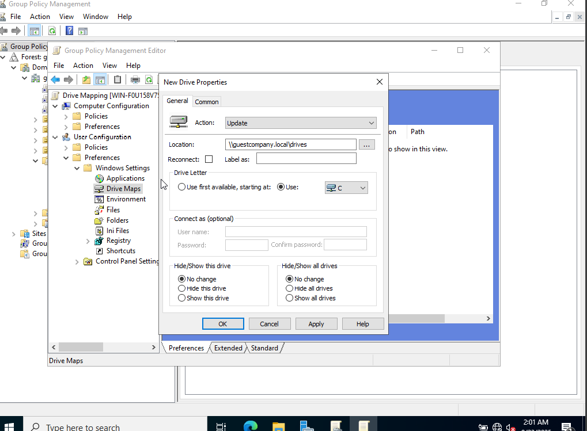
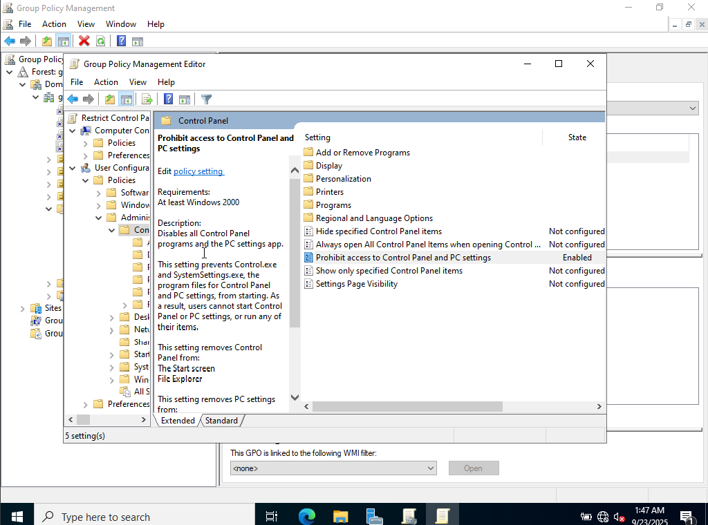
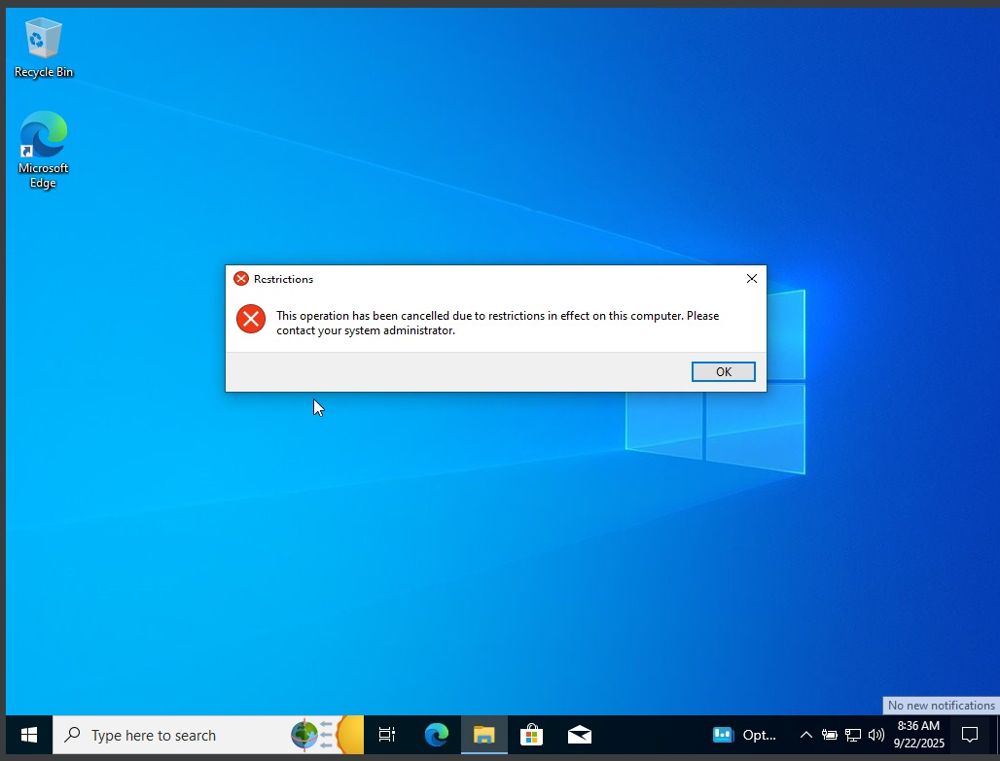
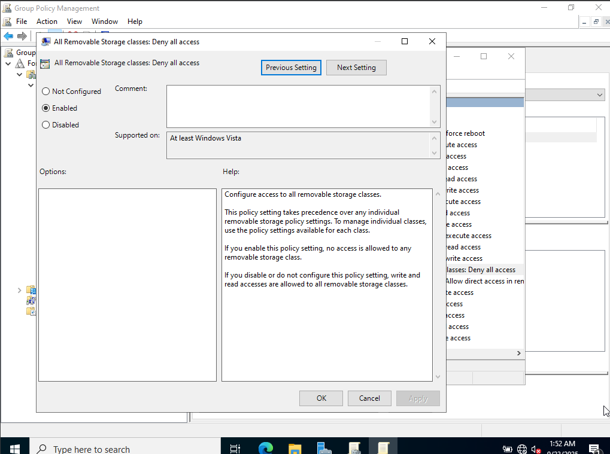
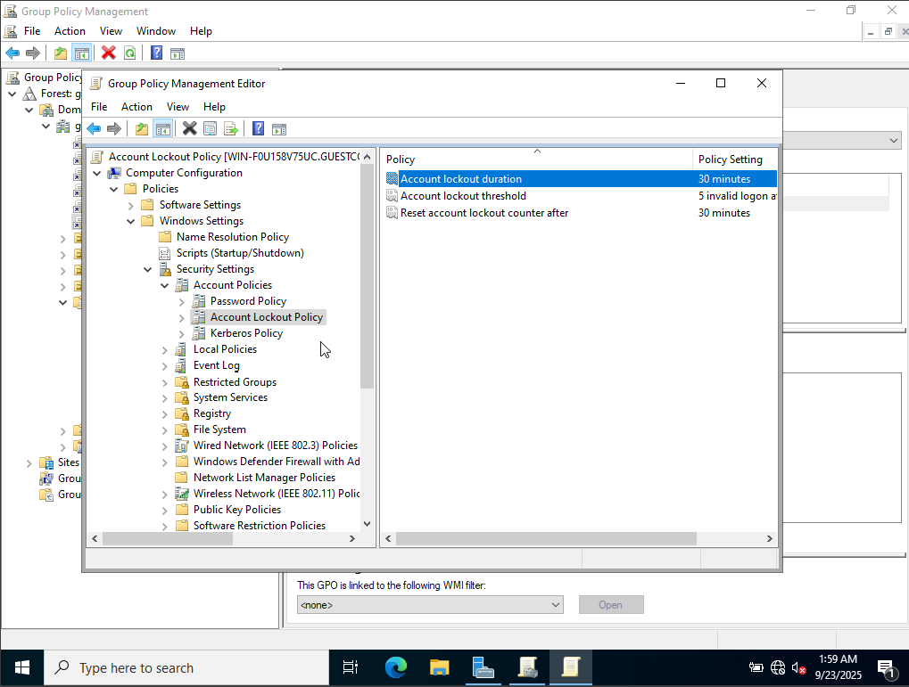
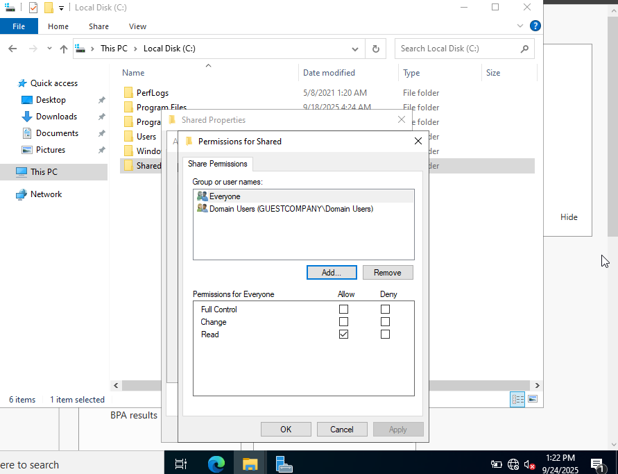
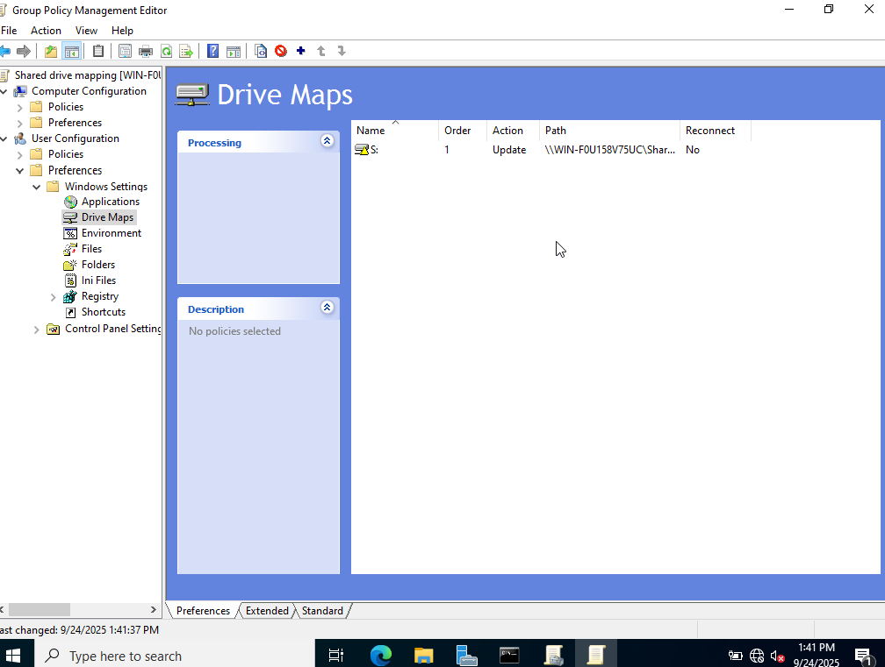
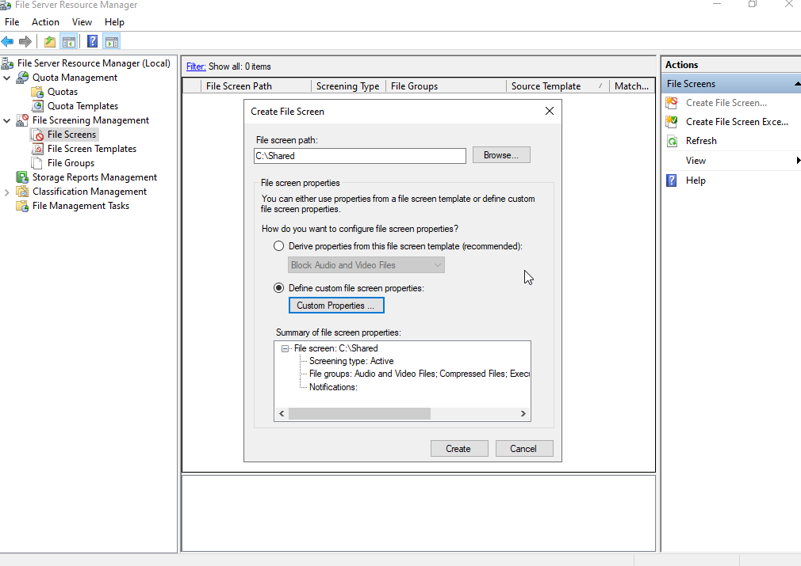

<h1>Active Directory Homelab</h1>

<h2>Description</h2>
This project focuses on building and testing Group Policies in a Windows Server Active Directory (AD) lab environment. Using the **Group Policy Management Console (GPMC)**, I created and enforced policies to improve security and user management. The project demonstrates how centralized policy management can be applied to control user access, enforce security standards, and manage system configurations across a domain.
 

<h2>📑 Table of Contents</h2>

- [Objectives](#objectives)  
- [What I Learned](#what-i-learned)  
- [Group Policy Objects (GPOs) Implemented](#group-policy-objects)  
  - [Password Policy](#password-policy)  
  - [Drive Mapping](#drive-mapping)  
  - [Restrict Access to Control Panel](#restrict-control-panel)  
  - [Prevent USB Storage](#prevent-usb-storage)  
  - [Account Lockout Policy](#account-lockout-policy)  
- [File Sharing and Storage Management](#file-sharing)

---

<a id="objectives"></a
<h2>Objectives</h2>

- <b>Install and Configure GPMC:</b> Add Group Policy Management Console via Server Manager.  
- <b>Understand GPMC Structure:</b> Learn differences between User Configuration vs. Computer Configuration and Policies vs. Preferences.  
- <b>Enforce Security Policies:</b> Apply Password Policy and Account Lockout Policy.  
- <b>Manage User Access:</b> Restrict Control Panel access and block USB storage devices.  
- <b>Improve User Experience:</b> Configure Drive Mapping for seamless network drive access.
- <b>Manage File Storage Efficiently:</b> Configure shared folders, NTFS/share permissions, FSRM quotas, and file screening.

--- 

<h2>What I Learned</h2>

- How to install and set up **Group Policy Management Console (GPMC)**.  
- Difference between **User Configuration** (applies to users) and **Computer Configuration** (applies to systems).  
- Difference between **Policies** (enforced, not changeable by users) and **Preferences** (default settings that users can modify).  
- Practical implementation of GPOs to enforce enterprise security standards.
- How to configure **file sharing** with both NTFS and share permissions for secure access control.  
- How to implement **FSRM (File Server Resource Manager)** for quotas and file screening to optimize storage and enforce compliance.  
- The importance of combining GPOs and storage policies to build a **secure, efficient, and enterprise-ready Active Directory environment**.

---

<h2>Group Policy Objects (GPOs) Implemented</h2>

<h3>1. Password Policy</h3>  

This GPO enforces strong password requirements for all users in the domain to enhance security.  

<b>Steps to Configure Password Policy:</b>  

- <b>Step 1:</b> In **GPMC**, right-click on the domain → **Create GPO in this domain, and Link it here** → Give the policy a meaningful name (e.g., "Domain Password Policy").  

- <b>Step 2:</b> Right-click on the new GPO and select **Edit**.  
  - Here comes the tricky part: deciding whether to apply it under **User Configuration** or **Computer Configuration**.  
  - Since a password policy should apply to **all users regardless of which system they log into**, it is best applied under **Computer Configuration**.  
  - Also, password complexity requirements should be **enforced (Policy)** so that users cannot modify them.  

- <b>Step 3:</b> Navigate to:  
  `Computer Configuration → Policies → Windows Settings → Security Settings → Account Policies → Password Policy`  

- <b>Step 4:</b> Configure attributes such as:  
  - Minimum password length  
  - Password complexity (uppercase, lowercase, numbers, special characters)  
  - Maximum password age  
  - Enforce password history
 
  

- <b>Step 5:</b> Click **Apply** and close the editor. The policy will now be enforced across the domain.  

---

<h3>2. Drive Mapping</h3>  

<b>Introduction</b>  
Drive mapping is an important feature in Active Directory environments that allows administrators to provide users with seamless access to shared resources. Instead of requiring users to remember and manually connect to shared network paths, drive mapping assigns a shared folder on a file server to a specific drive letter (e.g., H: or Z:) on each user’s workstation. This makes accessing shared data as simple as opening a local drive.  

<b>Purpose of Drive Mapping</b>  
The main purpose of drive mapping is to simplify access to organizational files while ensuring central management and security. For example, a department like Finance or HR may have a shared folder stored on a file server. Through drive mapping, all employees in that department automatically see the shared folder as a drive on their computer. This approach ensures consistency, improves collaboration, and enforces the principle of least privilege by granting access only to the correct users or groups.  

<b>Implementation Steps</b>  

- <b>Step 1:</b> In **GPMC**, right-click on the domain → **Create GPO in this domain, and Link it here** → Give the policy a meaningful name (e.g., "Drive Mapping Policy").  

- <b>Step 2:</b> Right-click on the new GPO and select **Edit**. Since drive mappings are specific to users, expand:  
  `User Configuration → Preferences → Windows Settings → Drive Maps`  

- <b>Step 3:</b> Right-click on **Drive Maps** → **New → Mapped Drive**.  

- <b>Step 4:</b> In the dialog box:  
  - Enter the **location of the shared folder** (e.g., `\\FileServer\Finance`) in the “Location” field.  
  - Choose the **Drive Letter** to map (e.g., H:).  
  - Select **Update** action so that changes automatically apply to users.  

- <b>Step 5:</b> Apply and close the policy editor. When the user logs in, the mapped drive will automatically appear on their workstation.
  

<b>Reasoning:</b>  
This policy is placed under **User Configuration** and as a **Preference** (not Policy) so users have the flexibility to later modify the mapped drive if needed.

---

<h3>3. Restrict Access to Control Panel</h3>  

<b>Introduction</b>  
The Restrict Access to Control Panel policy is a security and administrative control in Active Directory that prevents users from accessing the Windows Control Panel. The Control Panel provides options to change critical system settings such as network configurations, user accounts, and installed programs. Without restrictions, users may inadvertently or intentionally modify system settings, which can cause security risks or operational issues.  

<b>Purpose of the Policy</b>  
The main purpose of restricting access to the Control Panel is to enforce centralized management of system settings. By blocking user access, organizations can ensure that only administrators retain control over configurations. This prevents accidental misconfigurations by end users and reduces the risk of unauthorized applications being installed, security settings being changed, or device configurations being altered in ways that could weaken the organization’s security posture.  

<b>Implementation Steps</b>  

- <b>Step 1:</b> In **GPMC**, right-click on the domain → **Create GPO in this domain, and Link it here** → Give the policy a meaningful name (e.g., "Restrict Control Panel Policy").  

- <b>Step 2:</b> Right-click on the new GPO and select **Edit**. Since this is a user-focused restriction, expand:  
  `User Configuration → Policies → Administrative Templates → Control Panel`  

- <b>Step 3:</b> Locate and enable the setting:  
  **Prohibit access to Control Panel and PC settings**.  

- <b>Step 4:</b> Apply and close the editor. Once the policy is refreshed, users will no longer be able to access the Control Panel.

<b>Reasoning:</b>  
This policy is placed under **User Configuration → Policies** because it applies directly to end-user accounts and should be strictly enforced without giving users the option to modify it.  

 
 

---

<h3>4. Prevent USB Storage</h3>  

<b>Introduction</b>  
The Prevent USB Storage policy is a security control in Active Directory designed to block users from connecting and using unauthorized USB storage devices on their computers. USB devices such as flash drives and external hard disks pose significant security risks, including the potential for data theft, malware infections, and unauthorized file transfers. By enforcing this policy, organizations can protect sensitive information and reduce the risk of insider threats or accidental data leakage.  

<b>Purpose of the Policy</b>  
The purpose of this policy is to restrict the use of removable storage devices within the enterprise environment. Many security breaches occur when confidential data is copied onto portable devices or when malicious software is introduced from an infected USB drive. Preventing the use of USB storage ensures that all data transfers happen through secure, monitored channels, thereby improving compliance with security policies and regulatory requirements.  

<b>Implementation Steps</b>  

- <b>Step 1:</b> In **GPMC**, right-click on the domain → **Create GPO in this domain, and Link it here** → Give the policy a meaningful name (e.g., "USB Storage Restriction Policy").  

- <b>Step 2:</b> Right-click on the new GPO and select **Edit**. Since this restriction is system-wide, expand:  
  `Computer Configuration → Policies → Administrative Templates → System → Removable Storage Access`  

- <b>Step 3:</b> Enable the setting:  
  **All Removable Storage classes: Deny all access**.  

- <b>Step 4:</b> Apply and close the editor. Once the policy is refreshed, users will no longer be able to access or use USB storage devices.  

<b>Reasoning:</b>  
This policy is applied under **Computer Configuration → Policies** because it affects the system as a whole, regardless of which user logs in. By applying it as a strict policy, administrators ensure that no user can bypass the restriction.  

---

<h3>5. Account Lockout Policy</h3>  

<b>Introduction</b>  
The Account Lockout Policy is a security feature in Active Directory that automatically locks a user account after a defined number of failed login attempts. This prevents attackers from using brute force or password-guessing techniques to gain unauthorized access to user accounts. Once an account is locked, the user must either wait until the lockout duration expires or contact an administrator to unlock the account.  

<b>Purpose of the Policy</b>  
The purpose of this policy is to protect user accounts from compromise by limiting repeated login attempts. In enterprise environments, user credentials are one of the primary targets for attackers. By enforcing account lockout rules, organizations can slow down or completely block automated password-cracking attempts. The policy also provides an early warning mechanism for administrators, since frequent account lockouts can indicate a potential security incident or malicious activity on the network.  

<b>Implementation Steps</b>  

- <b>Step 1:</b> In **GPMC**, right-click on the domain → **Create GPO in this domain, and Link it here** → Give the policy a meaningful name (e.g., "Account Lockout Policy").  

- <b>Step 2:</b> Right-click on the new GPO and select **Edit**. Since this is a system-wide security control, expand:  
  `Computer Configuration → Policies → Windows Settings → Security Settings → Account Policies → Account Lockout Policy`  

- <b>Step 3:</b> Configure the following attributes:  
  - **Account Lockout Threshold** (e.g., 5 invalid attempts)  
  - **Account Lockout Duration** (e.g., 30 minutes)  
  - **Reset Account Lockout Counter After** (e.g.,  30 minutes)  

- <b>Step 4:</b> Apply and close the editor. Once the policy is refreshed, accounts will automatically lock after repeated failed logins.  

<b>Reasoning:</b>  
This policy is applied under **Computer Configuration → Policies** because it must enforce protection across all systems in the domain, regardless of which user logs in. It is a critical safeguard against brute-force attacks and strengthens overall account security.

 
  
---

<h2> File Sharing and Storage Management</h2>  

<b>Introduction</b>  
File sharing is an essential feature in Active Directory environments, enabling centralized storage and controlled access to organizational data. Instead of users storing files locally, administrators configure shared folders on file servers, apply permissions, and make them accessible to domain users. To further secure and optimize storage usage, tools such as **File Server Resource Manager (FSRM)** are implemented to apply quotas and file screening rules.  

---

<b>Implementation of File Sharing</b>  

- Open **File Explorer** → select a drive → create a new folder.  
- Right-click the folder → **Properties** → go to the **Sharing** tab.  
- Click **Advanced Sharing** → enable **Share this folder**.  
- Under **Permissions**, type the domain name and click on check users then click on **Domain Users** and add.  
- On the **Security tab**, configure **NTFS permissions** to provide granular control (e.g., Read, Modify, or Full Control) based on user roles.  

This ensures that users can only access files they are authorized to use while administrators maintain full control.
 

---

<b>Drive Mapping for Access</b>  

On the client machine, users accessed the shared folder using the **Map Network Drive** option:  

- Open **File Explorer** → right-click on **This PC** → choose **Map network drive**.  
- Select a drive letter and provide the path of the shared folder (e.g., `\\ServerName\ShareName`).  
- Connect to the drive and access the shared folder.  

Note: Manual mapping is not persistent after a system reboot. To resolve this, a **Group Policy Object (GPO)** was configured to automatically map network drives for domain users, ensuring consistent access.  
 
---

<b>Quotas with FSRM</b>  

To manage disk usage, I implemented quotas using **File Server Resource Manager (FSRM):**  

- Open **FSRM** → navigate to **Quota Management**.  
- Right-click on **Quotas** → select **Create Quota**.  
- Set the quota path to the shared folder.  
- Define quota properties, including:  
  - Limit size (e.g., 500 MB or 1 GB per folder).  
  - **Hard quota** (prevents storage beyond the limit).  
  - **Notification thresholds** (alerts when usage reaches a defined percentage).  

This ensures efficient storage usage and prevents users from consuming excessive disk space.  

---

<b>File Screening with FSRM</b>  

To control what file types users can store:  

- Open **FSRM** → go to **File Screening Management**.  
- Create a new **File Screen** and apply it to the shared folder.  
- Select a **File Screen Template** (e.g., block executables, music, or video files).  

File screening ensures only business-related files are stored, reducing risks of malware, copyright issues, or unnecessary storage consumption.

 
---

<b>Importance of File Sharing and FSRM</b>  

By combining shared folder permissions, persistent drive mapping via GPO, and FSRM policies, organizations achieve:  

- Centralized access to resources.  
- Controlled permissions through NTFS and share-level restrictions.  
- Efficient storage usage with quotas.  
- Improved security and compliance with file screening.  
This creates a **secure, well-managed, and user-friendly file storage system** within the Active Directory environment.  

  
  
 
 
 
