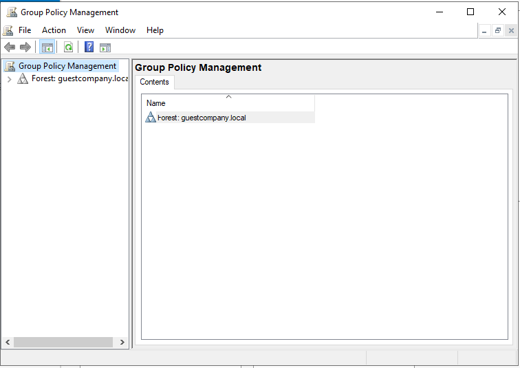

# Active-Directory-HomeLab
**What this is.** I built and tested domain Group Policies in a Windows Server AD lab to enforce password/lockout rules, map user drives, restrict Control Panel, and block USB storage. I learned how GPO **scope**, **precedence**, and **Policies vs. Preferences** affect real machines and users.

---

## Table of contents
- [What I set up](#what-i-set-up)
  - [Install GPMC](#install-gpmc)
  - [Verify domain in GPMC](#verify-domain-in-gpmc)
  - [GPOs I created & linked](#gpos-i-created--linked)
- [Key concepts I learned](#key-concepts-i-learned)
- [How to recreate (quick steps)](#how-to-recreate-quick-steps)
- [Why each policy matters](#why-each-policy-matters)
- [Screenshots](#screenshots)

---

## What I set up

### Install GPMC
Server Manager → **Manage** → **Add Roles and Features** → **Features** → **Group Policy Management**.    


### Verify domain in GPMC
Confirmed the domain **`guestcompany.local`** appears in Group Policy Management.  
*Screenshot:*  


### GPOs I created & linked

#### 1) Domain Password Policy (domain-wide)
- **Path:** `Computer Configuration → Policies → Windows Settings → Security Settings → Account Policies → Password Policy`
- **Why:** Enforce strong passwords for all domain users.
- **Note:** In AD, **password & account policies for domain accounts must come from a GPO linked at the domain level** (often the *Default Domain Policy* or another domain-linked GPO with higher precedence).
- *Screenshot:*  
  

#### 2) Account Lockout Policy (domain-wide)
- **Path:** `Computer Configuration → Policies → Windows Settings → Security Settings → Account Policies → Account Lockout Policy`
- **Example values:** Threshold **5** invalid attempts, duration **30 min**, reset **30 min**.
- *Screenshot:*  
  

#### 3) Drive Mapping (targeted to user OUs)
- **Path:** `User Configuration → Preferences → Windows Settings → Drive Maps`
- **Why:** Automatically map a network share (e.g., `\\guestcompany.local\drives`) at logon, **but allow users to change it later** (that’s why it’s a *Preference*, not a *Policy*).
- *Screenshot:*  
  

#### 4) Restrict Control Panel & PC Settings (targeted to user OUs)
- **Path:** `User Configuration → Policies → Administrative Templates → Control Panel → Prohibit access to Control Panel and PC settings` → **Enabled**
- *Screenshot:*  
  

#### 5) Block USB / Removable Storage (targeted to device OUs)
- **Path:** `Computer Configuration → Policies → Administrative Templates → System → Removable Storage Access → All Removable Storage classes: Deny all access` → **Enabled**
- *Screenshot:*  
  

---

## Key concepts I learned

**User vs. Computer Configuration**
- *User Configuration* follows the **user** across devices.
- *Computer Configuration* applies to the **machine** regardless of who logs on.

**Policies vs. Preferences**
- *Policies* are enforced/locked down (users can’t change).
- *Preferences* set defaults (users can override). Great for things like drive maps.

**GPO Scope & Precedence**
- Link GPOs where they belong: **Site → Domain → OU**. The closest link (e.g., OU) wins when conflicts exist (unless you use **Enforced** or **Block Inheritance**).
- **Password & Account Lockout** policies for domain users only take effect from a **domain-linked** GPO.

---

## How to recreate (quick steps)

1. In **GPMC**, right-click your target scope (Domain or OU) → **Create a GPO in this domain, and Link it here…** → give it a clear name.  
2. Right-click the GPO → **Edit…** → configure settings using the paths above.  
3. Target the right objects: link **user** settings to user OUs; **computer** settings to device OUs; keep domain-wide settings (password/lockout) linked at the **domain**.  
4. Apply & verify on clients/servers:
   ```powershell
   gpupdate /force
   gpresult /r                # quick summary
   gpresult /h %TEMP%\gp.html # detailed HTML report
